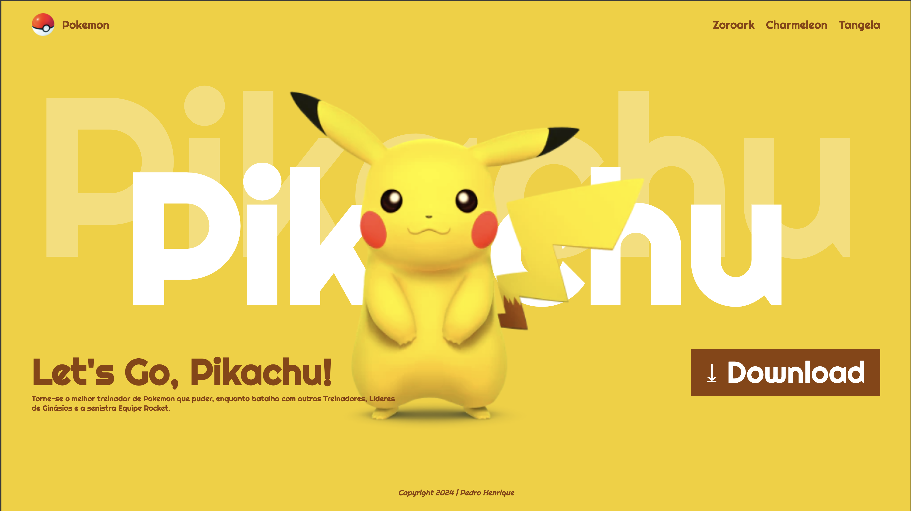

# Landing Page - Let's Go, Pikachu

---

## Sobre
Site tipo landing page para divulgar o jogo Let's Go, Pikachu. O objetivo é colocar em prática os conhecimentos adquiridos sobre linguagem de marcação, durante o curso de desenvolvimento de sisistema no [SENAI Jajdiea](https://sp.senai.br/unidade/jandira/)

---

##Tecnologias utilizadas

- HTML
- CSS
- Markdown
- Git

--- 

## Autor
- [Pedro Henrique](https://www.linkedin.com/in/pedro-fernandes-954b20308/)